# README
The template loosely adheres to the syntax rules of Python f-string formatting.    
- The {} placeholders are intended for string substitutions.
- The [] brackets denote optional strings.

# Workflow
This template file helps in annotating Hartree-Fock Mean-Field theory papers by providing a collection of prompts, which should be followed in a specific order based on the type of the paper.

We categorized the papers based on:
* Hamiltonian: continuum | lattice
* Formalism: first-quantized | second-quantized
* Order parameter: Hartree | Fock | Hartree-Fock 

**Note:** The combination of 'lattice' and 'first-quantized' is incompatible.

Detailed workflows for each paper category are as follows:

## lattice, second-quantized, Hartree
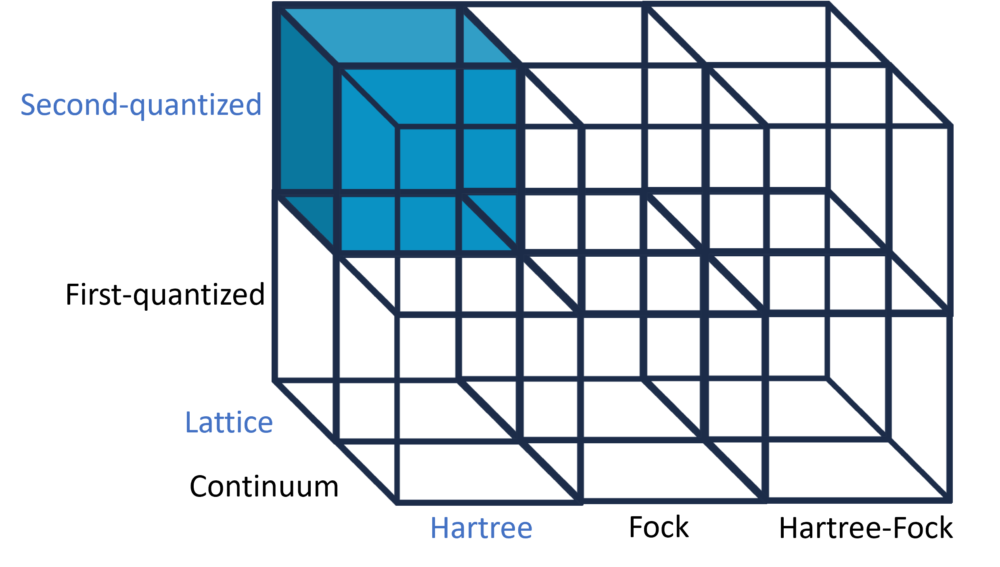
**Example**: [1106.6060](1106.6060/1106.6060.md)
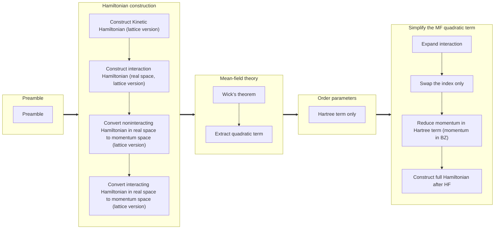
```mermaid
flowchart LR
    subgraph A["Preamble"]
        direction TB
        a1["Preamble"]
    end
    subgraph B["Hamiltonian construction"]
        direction TB
        b1["Construct Kinetic Hamiltonian (lattice version)"]
        b2["Construct interaction Hamiltonian (real space, lattice version)"]
        b3["Convert noninteracting Hamiltonian in real space to momentum space (lattice version)"]
        b4["Convert interacting Hamiltonian in real space to momentum space (lattice version)"]
        b1-->b2
        b2-->b3
        b3-->b4
    end
    subgraph C["Mean-field theory"]
        direction TB
        c1["Wick's theorem"]
        c2["Extract quadratic term"]
        c1-->c2
    end
    subgraph D["Order parameters"]
        direction TB
        d1["Hartree term only"]
    end
    subgraph E["Simplify the MF quadratic term"]
        direction TB
        e1["Expand interaction"]
        e2["Swap the index only"]
        e3["Reduce momentum in Hartree term (momentum in BZ)"]
        e4["Construct full Hamiltonian after HF"]
        e1-->e2
        e2-->e3
        e3-->e4
    end
    A==>B
    B==>C
    C==>D
    D==>E
```
## lattice, second-quantized, Fock
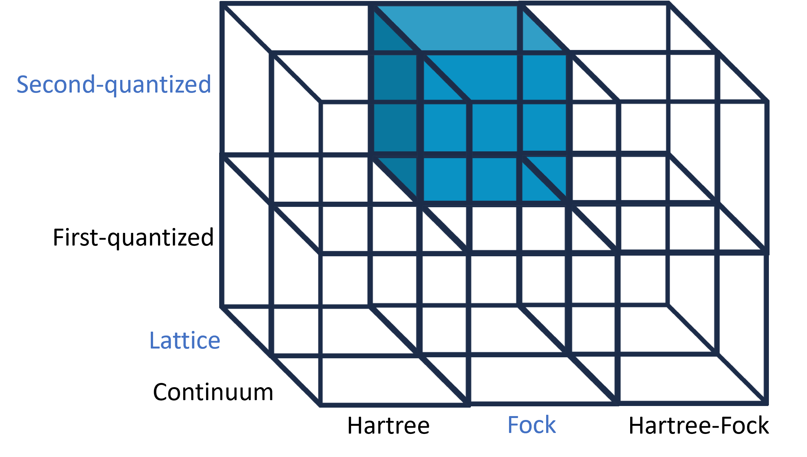
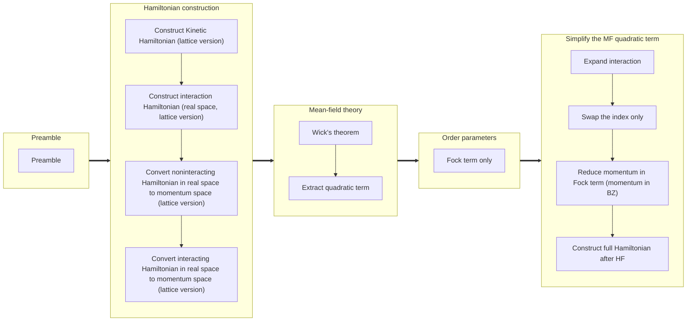
```mermaid
flowchart LR
    subgraph A["Preamble"]
        direction TB
        a1["Preamble"]
    end
    subgraph B["Hamiltonian construction"]
        direction TB
        b1["Construct Kinetic Hamiltonian (lattice version)"]
        b2["Construct interaction Hamiltonian (real space, lattice version)"]
        b3["Convert noninteracting Hamiltonian in real space to momentum space (lattice version)"]
        b4["Convert interacting Hamiltonian in real space to momentum space (lattice version)"]
        b1-->b2
        b2-->b3
        b3-->b4
    end
    subgraph C["Mean-field theory"]
        direction TB
        c1["Wick's theorem"]
        c2["Extract quadratic term"]
        c1-->c2
    end
    subgraph D["Order parameters"]
        direction TB
        d1["Fock term only"]
    end
    subgraph E["Simplify the MF quadratic term"]
        direction TB
        e1["Expand interaction"]
        e2["Swap the index only"]
        e3["Reduce momentum in Fock term (momentum in BZ)"]
        e4["Construct full Hamiltonian after HF"]
        e1-->e2
        e2-->e3
        e3-->e4
    end
    A==>B
    B==>C
    C==>D
    D==>E
```
## lattice, second-quantized, Hartree-Fock
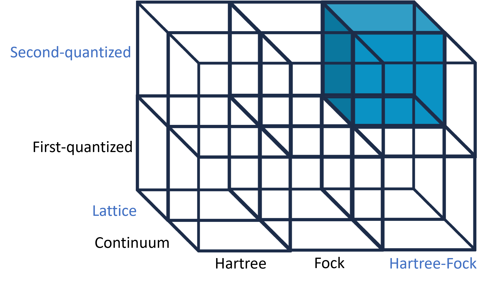
**Example**: [2004.04168](2004.04168/2004.04168.md)
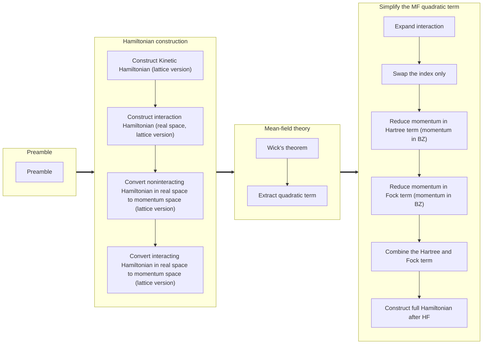
```mermaid
flowchart LR
    subgraph A["Preamble"]
        direction TB
        a1["Preamble"]
    end
    subgraph B["Hamiltonian construction"]
        direction TB
        b1["Construct Kinetic Hamiltonian (lattice version)"]
        b2["Construct interaction Hamiltonian (real space, lattice version)"]
        b3["Convert noninteracting Hamiltonian in real space to momentum space (lattice version)"]
        b4["Convert interacting Hamiltonian in real space to momentum space (lattice version)"]
        b1-->b2
        b2-->b3
        b3-->b4
    end
    subgraph C["Mean-field theory"]
        direction TB
        c1["Wick's theorem"]
        c2["Extract quadratic term"]
        c1-->c2
    end
    subgraph E["Simplify the MF quadratic term"]
        direction TB
        e1["Expand interaction"]
        e2["Swap the index only"]
        e3["Reduce momentum in Hartree term (momentum in BZ)"]
        e4["Reduce momentum in Fock term (momentum in BZ)"]
        e5["Combine the Hartree and Fock term"]
        e6["Construct full Hamiltonian after HF"]
        e1-->e2
        e2-->e3
        e3-->e4
        e4-->e5
        e5-->e6
    end
    A==>B
    B==>C
    C==>E
```

## continuum, first-quantized, Hartree
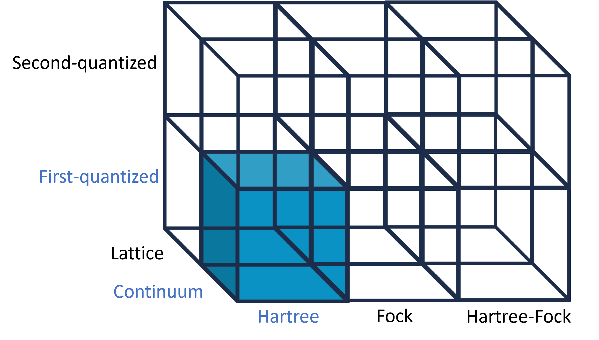
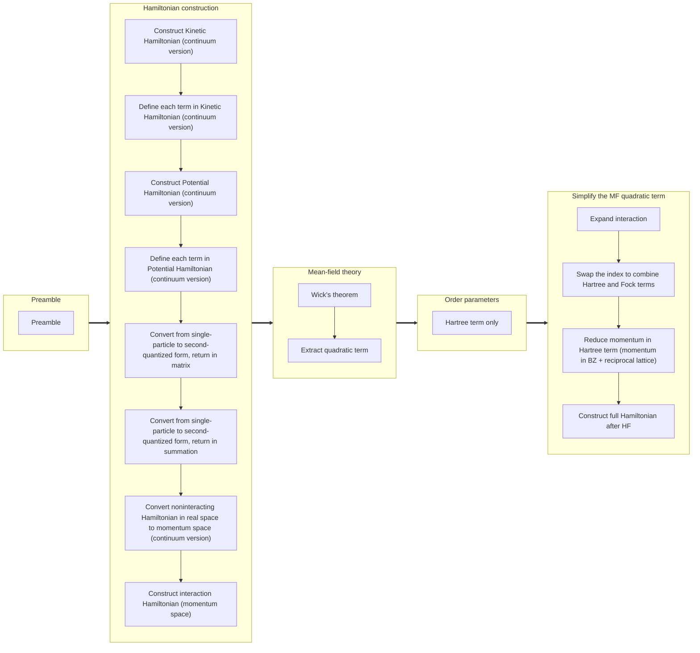
```mermaid
flowchart LR
    subgraph A["Preamble"]
        direction TB
        a1["Preamble"]
    end
    subgraph B["Hamiltonian construction"]
        direction TB
        b1["Construct Kinetic Hamiltonian (continuum version)"]
        b2["Define each term in Kinetic Hamiltonian (continuum version)"]
        b3["Construct Potential Hamiltonian (continuum version)"]
        b4["Define each term in Potential Hamiltonian (continuum version)"]
        b5["Convert from single-particle to second-quantized form, return in matrix"]
        b6["Convert from single-particle to second-quantized form, return in summation"]
        b7["Convert noninteracting Hamiltonian in real space to momentum space (continuum version)"]
        b8["Construct interaction Hamiltonian (momentum space)"]
        b1-->b2
        b2-->b3
        b3-->b4
        b4-->b5
        b5-->b6
        b6-->b7
        b7-->b8
    end
    subgraph C["Mean-field theory"]
        direction TB
        c1["Wick's theorem"]
        c2["Extract quadratic term"]
        c1-->c2
    end
    subgraph D["Order parameters"]
        direction TB
        d1["Hartree term only"]
    end
    subgraph E["Simplify the MF quadratic term"]
        direction TB
        e1["Expand interaction"]
        e2["Swap the index to combine Hartree and Fock terms"]
        e3["Reduce momentum in Hartree term (momentum in BZ + reciprocal lattice)"]
        e4["Construct full Hamiltonian after HF"]
        e1-->e2
        e2-->e3
        e3-->e4
    end
    A==>B
    B==>C
    C==>D
    D==>E
```
## continuum, first-quantized, Fock
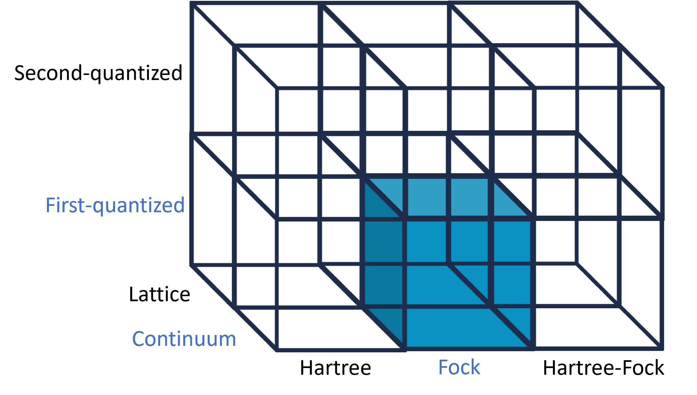

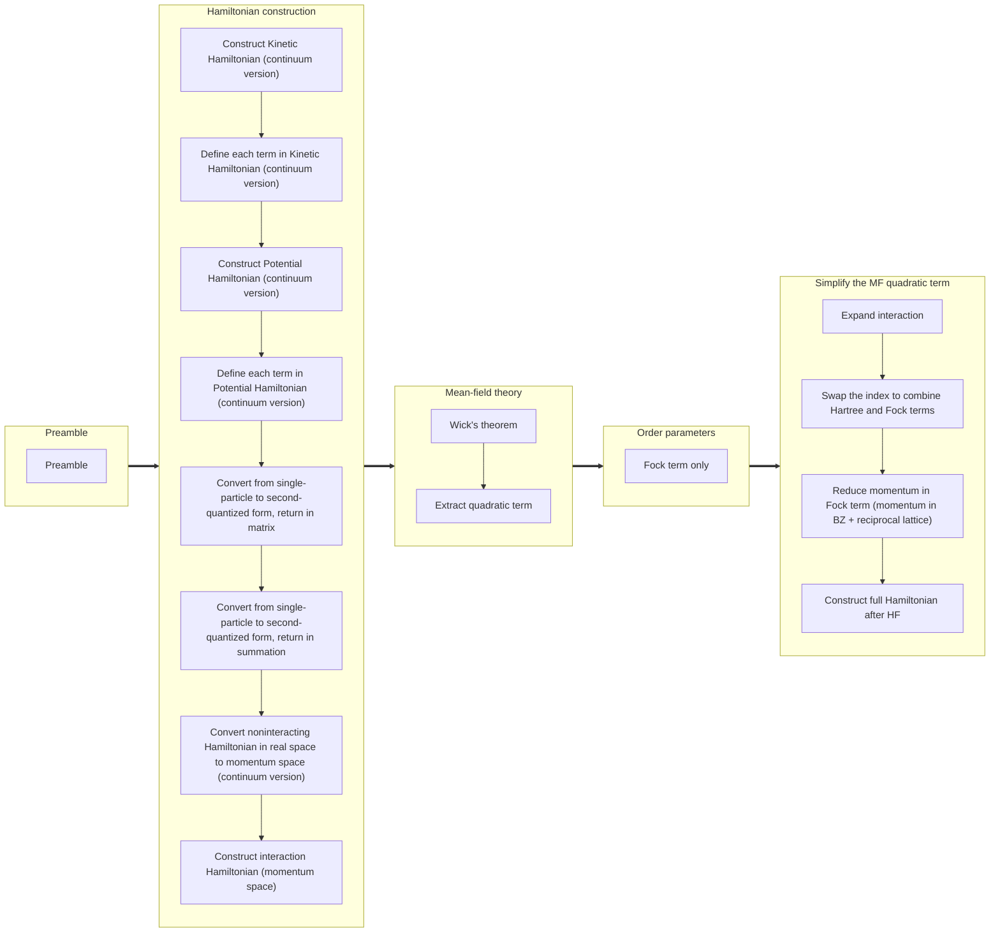
```mermaid
flowchart LR
    subgraph A["Preamble"]
        direction TB
        a1["Preamble"]
    end
    subgraph B["Hamiltonian construction"]
        direction TB
        b1["Construct Kinetic Hamiltonian (continuum version)"]
        b2["Define each term in Kinetic Hamiltonian (continuum version)"]
        b3["Construct Potential Hamiltonian (continuum version)"]
        b4["Define each term in Potential Hamiltonian (continuum version)"]
        b5["Convert from single-particle to second-quantized form, return in matrix"]
        b6["Convert from single-particle to second-quantized form, return in summation"]
        b7["Convert noninteracting Hamiltonian in real space to momentum space (continuum version)"]
        b8["Construct interaction Hamiltonian (momentum space)"]
        b1-->b2
        b2-->b3
        b3-->b4
        b4-->b5
        b5-->b6
        b6-->b7
        b7-->b8
    end
    subgraph C["Mean-field theory"]
        direction TB
        c1["Wick's theorem"]
        c2["Extract quadratic term"]
        c1-->c2
    end
    subgraph D["Order parameters"]
        direction TB
        d1["Fock term only"]
    end
    subgraph E["Simplify the MF quadratic term"]
        direction TB
        e1["Expand interaction"]
        e2["Swap the index to combine Hartree and Fock terms"]
        e3["Reduce momentum in Fock term (momentum in BZ + reciprocal lattice)"]
        e4["Construct full Hamiltonian after HF"]
        e1-->e2
        e2-->e3
        e3-->e4
    end
    A==>B
    B==>C
    C==>D
    D==>E
```

## continuum, first-quantized, Hartree-Fock
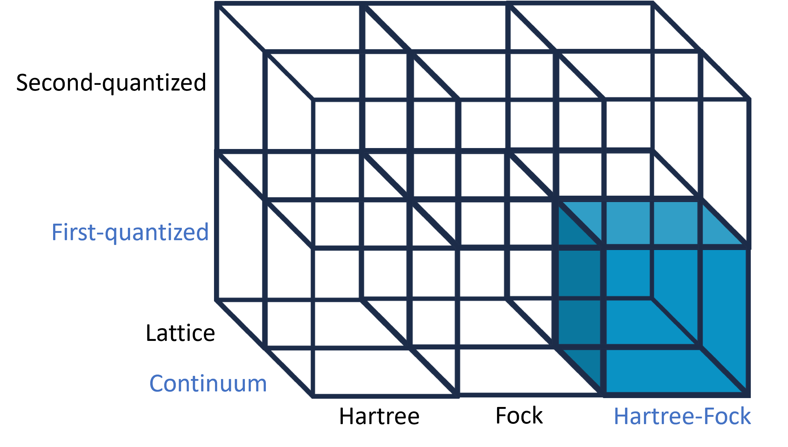
**Example**: [2111.01152](2111.01152/2111.01152.md), [2108.02159](2108.02159/2108.02159.md), [1812.04213](1812.04213/1812.04213.md)
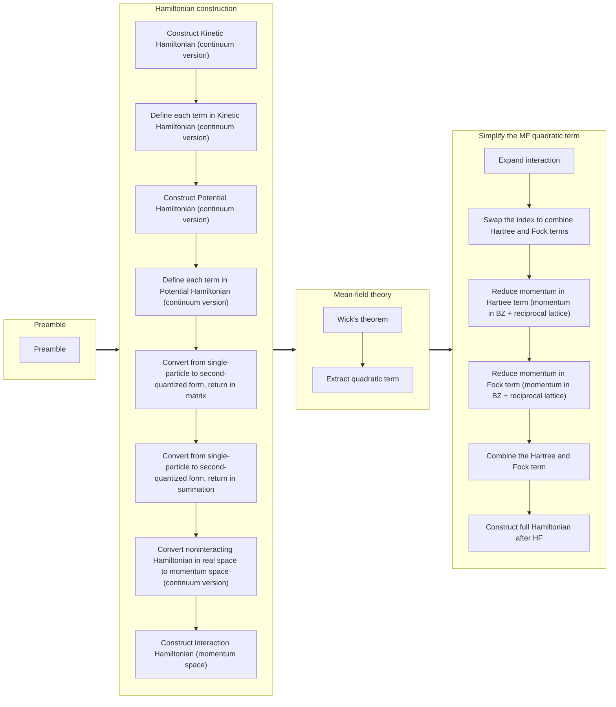
```mermaid
flowchart LR
    subgraph A["Preamble"]
        direction TB
        a1["Preamble"]
    end
    subgraph B["Hamiltonian construction"]
        direction TB
        b1["Construct Kinetic Hamiltonian (continuum version)"]
        b2["Define each term in Kinetic Hamiltonian (continuum version)"]
        b3["Construct Potential Hamiltonian (continuum version)"]
        b4["Define each term in Potential Hamiltonian (continuum version)"]
        b5["Convert from single-particle to second-quantized form, return in matrix"]
        b6["Convert from single-particle to second-quantized form, return in summation"]
        b7["Convert noninteracting Hamiltonian in real space to momentum space (continuum version)"]
        b8["Construct interaction Hamiltonian (momentum space)"]
        b1-->b2
        b2-->b3
        b3-->b4
        b4-->b5
        b5-->b6
        b6-->b7
        b7-->b8
    end
    subgraph C["Mean-field theory"]
        direction TB
        c1["Wick's theorem"]
        c2["Extract quadratic term"]
        c1-->c2
    end
    subgraph E["Simplify the MF quadratic term"]
        direction TB
        e1["Expand interaction"]
        e2["Swap the index to combine Hartree and Fock terms"]
        e3["Reduce momentum in Hartree term (momentum in BZ + reciprocal lattice)"]
        e4["Reduce momentum in Fock term (momentum in BZ + reciprocal lattice)"]
        e5["Combine the Hartree and Fock term"]
        e6["Construct full Hamiltonian after HF"]
        e1-->e2
        e2-->e3
        e3-->e4
        e4-->e5
        e5-->e6
    end
    A==>B
    B==>C
    C==>E
```

## continuum, second-quantized, Hartree
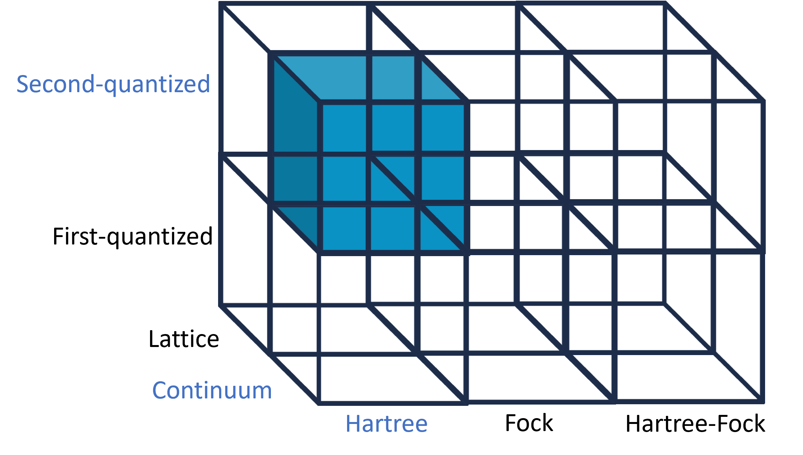

```mermaid
flowchart LR
    subgraph A["Preamble"]
        direction TB
        a1["Preamble"]
    end
    subgraph B["Hamiltonian construction"]
        direction TB
        b1["Construct Kinetic Hamiltonian (continuum version)"]
        b2["Define each term in Kinetic Hamiltonian (continuum version)"]
        b3["Construct Potential Hamiltonian (continuum version)"]
        b4["Define each term in Potential Hamiltonian (continuum version)"]
        b7["Convert noninteracting Hamiltonian in real space to momentum space (continuum version)"]
        b8["Construct interaction Hamiltonian (momentum space)"]
        b1-->b2
        b2-->b3
        b3-->b4
        b4-->b7
        b7-->b8
    end
    subgraph C["Mean-field theory"]
        direction TB
        c1["Wick's theorem"]
        c2["Extract quadratic term"]
        c1-->c2
    end
    subgraph D["Order parameters"]
        direction TB
        d1["Hartree term only"]
    end
    subgraph E["Simplify the MF quadratic term"]
        direction TB
        e1["Expand interaction"]
        e2["Swap the index to combine Hartree and Fock terms"]
        e3["Reduce momentum in Hartree term (momentum in BZ + reciprocal lattice)"]
        e4["Construct full Hamiltonian after HF"]
        e1-->e2
        e2-->e3
        e3-->e4
    end
    A==>B
    B==>C
    C==>D
    D==>E
```
## continuum, second-quantized, Fock
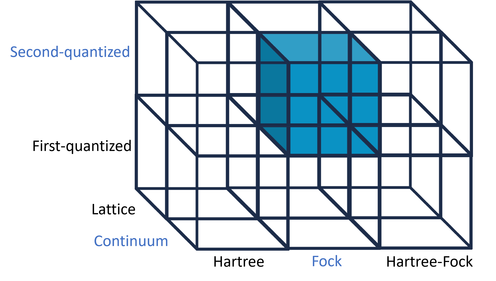
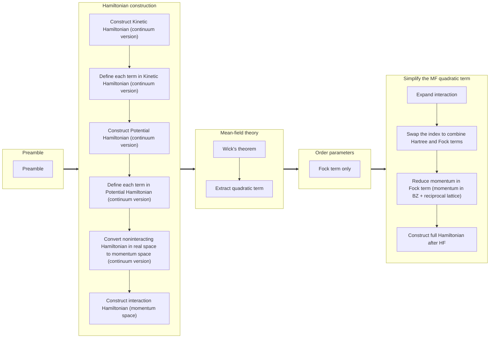
```mermaid
flowchart LR
    subgraph A["Preamble"]
        direction TB
        a1["Preamble"]
    end
    subgraph B["Hamiltonian construction"]
        direction TB
        b1["Construct Kinetic Hamiltonian (continuum version)"]
        b2["Define each term in Kinetic Hamiltonian (continuum version)"]
        b3["Construct Potential Hamiltonian (continuum version)"]
        b4["Define each term in Potential Hamiltonian (continuum version)"]
        b7["Convert noninteracting Hamiltonian in real space to momentum space (continuum version)"]
        b8["Construct interaction Hamiltonian (momentum space)"]
        b1-->b2
        b2-->b3
        b3-->b4
        b4-->b7
        b7-->b8
    end
    subgraph C["Mean-field theory"]
        direction TB
        c1["Wick's theorem"]
        c2["Extract quadratic term"]
        c1-->c2
    end
    subgraph D["Order parameters"]
        direction TB
        d1["Fock term only"]
    end
    subgraph E["Simplify the MF quadratic term"]
        direction TB
        e1["Expand interaction"]
        e2["Swap the index to combine Hartree and Fock terms"]
        e3["Reduce momentum in Fock term (momentum in BZ + reciprocal lattice)"]
        e4["Construct full Hamiltonian after HF"]
        e1-->e2
        e2-->e3
        e3-->e4
    end
    A==>B
    B==>C
    C==>D
    D==>E
```
## continuum, second-quantized, Hartree-Fock
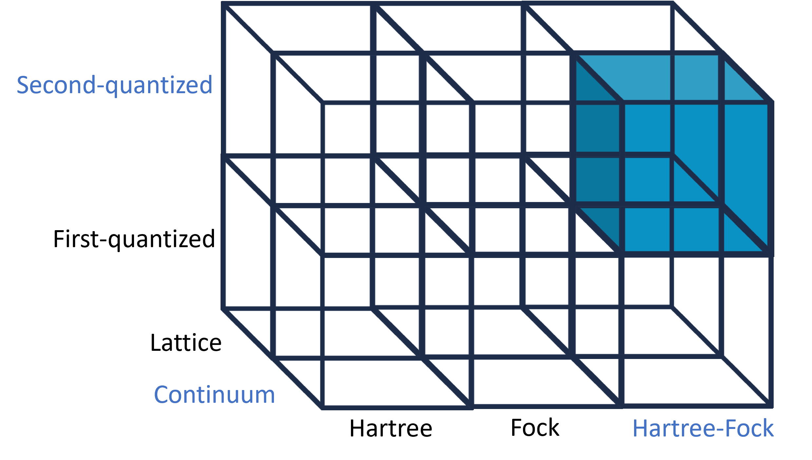
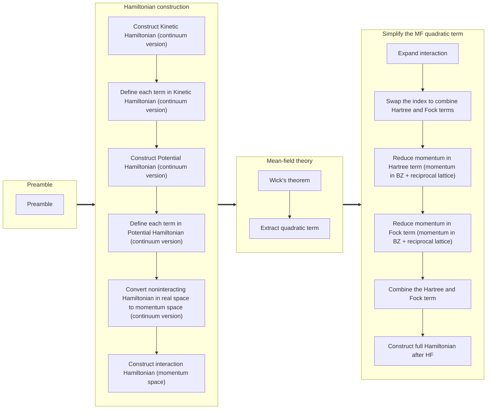
```mermaid
flowchart LR
    subgraph A["Preamble"]
        direction TB
        a1["Preamble"]
    end
    subgraph B["Hamiltonian construction"]
        direction TB
        b1["Construct Kinetic Hamiltonian (continuum version)"]
        b2["Define each term in Kinetic Hamiltonian (continuum version)"]
        b3["Construct Potential Hamiltonian (continuum version)"]
        b4["Define each term in Potential Hamiltonian (continuum version)"]
        b7["Convert noninteracting Hamiltonian in real space to momentum space (continuum version)"]
        b8["Construct interaction Hamiltonian (momentum space)"]
        b1-->b2
        b2-->b3
        b3-->b4
        b4-->b7
        b7-->b8
    end
    subgraph C["Mean-field theory"]
        direction TB
        c1["Wick's theorem"]
        c2["Extract quadratic term"]
        c1-->c2
    end
    subgraph E["Simplify the MF quadratic term"]
        direction TB
        e1["Expand interaction"]
        e2["Swap the index to combine Hartree and Fock terms"]
        e3["Reduce momentum in Hartree term (momentum in BZ + reciprocal lattice)"]
        e4["Reduce momentum in Fock term (momentum in BZ + reciprocal lattice)"]
        e5["Combine the Hartree and Fock term"]
        e6["Construct full Hamiltonian after HF"]
        e1-->e2
        e2-->e3
        e3-->e4
        e4-->e5
        e5-->e6
    end
    A==>B
    B==>C
    C==>E
```

# Preamble
## Preamble
**Prompt:**  
You are a physicist helping me to construct Hamiltonian and perform Hartree-Fock step by step based on my instructions. 
You should follow the instruction strictly.
Your reply should be succinct while complete. You should not expand any unwanted content.
You will be learning background knowledge by examples if necessary.
Confirm and repeat your duty if you understand it.

# Hamiltonian construction
## Construct Kinetic Hamiltonian (continuum version)
**Prompt:**  
You will be instructed to describe the kinetic term of Hamiltonian in {system} in the {real|momentum} space in the {single-particle|second-quantized} form.   
The degrees of freedom of the system are: {dof}  
Express the Kinetic Hamiltonian {symbol} using {var} which are only on the diagonal terms, and arrange the basis in the order of {order}.

Use the following conventions for the symbols:  
{def of var}

## Construct Kinetic Hamiltonian (lattice version)
**Prompt:**  
You will be instructed to describe the kinetic term of Hamiltonian in {system} in the {real|momentum} space in the {single-particle|second-quantized} form.   
The degrees of freedom of the system are: {dof}     
The kinetic term is a tight-binding model composed of the following hopping process: 
1. {site i} and {site j} with the hopping amplitude {hopping}.  
[You should ensure the hermiticity of the Hamiltonian.]
The summation should be taken over all {dof} and all real space positions.  
Return the Kinetic Hamiltonian {symbol}.

Use the following conventions for the symbols:  
{def of var}

## Define each term in Kinetic Hamiltonian (continuum version)
**Prompt:**  
Now you will be instructed to construct each term in the matrix, namely {var}.  
{Def of each var}
Return the expression for {var} in the Kinetic Hamiltonian, and substitute it into the Kinetic Hamiltonian {symbol}.  

Use the following conventions for the symbols (You should also obey the conventions in all my previous prompts if you encounter undefined symbols. If you find it is never defined or has conflicts in the conventions, you should stop and let me know):  
{def of var}

## Construct Potential Hamiltonian (continuum version)
**Prompt:**  
Now you will be instructed to describe the potential term of Hamiltonian {system} in the {real|momentum} space in the {single-particle|second-quantized} form.  
The potential Hamiltonian has the same degrees of freedom as the kinetic Hamiltonian {symbol}.  
{def of var}.  
Express the potential Hamiltonian {symbol} using {var}.  

Use the following conventions for the symbols (You should also remember the conventions in my previous prompts if there are no conflicts. If you have conflicts in the conventions, you should stop and let me know):  
{def of var}

## Define each term in Potential Hamiltonian (continuum version)
**Prompt:**  
Now you will be instructed to construct each term in the matrix {symbol}, namely, the intralayer potential {terms}.  
{def of each term}  
Return the expressions for {symbol}, and substitute it into the potential Hamiltonian {symbol}.  

Use the following conventions for the symbols (You should also obey the conventions in all my previous prompts if you encounter undefined symbols. If you find it is never defined or have conflicts in the conventions, you should stop and let me know):  
{def of var}

## Construct interaction Hamiltonian (real space, lattice version)
**Prompt:**  
Now you will be instructed to construct the interaction part of the Hamiltonian, {symbol} in the real space in the second-quantized form.   
The interacting Hamiltonian has the same degrees of freedom as the kinetic Hamiltonian {symbol}.  
The interaction is a density-density interaction composed of the following process:
1. onsite interaction between {site i} and {site j} with interaction strength {interaction}
The summation should be taken over all {dof} and all real space positions.  
Return the interaction term {symbol} in terms of {symbol}.

Use the following conventions for the symbols (You should also remember the conventions in my previous prompts if there are no conflicts. If you have conflicts in the conventions, you should stop and let me know): 
{def of var}

## Construct interaction Hamiltonian (momentum space)
**Prompt:**  
Now you will be instructed to construct the interaction part of the Hamiltonian {symbol} in the momentum space.  
The interaction Hamiltonian is a product of four parts.
The first part is the product of four operators with two creation and two annihilation operators following the normal order, namely, creation operators are before annihilation operators. The two creation operators carry {index}, and {order of momentum}. The two annihilation operators have the same {index}. You should follow the order of $1,2,2,1$ for the {index}, $1,2,3,4$ for the { momentum}. 
The second part is the constraint of total momentum conservation, namely the total momentum of all creation operators should be the same as that of all annihilation operators. [For each operator, the total momentum is the sum of moire reciprocal lattice $b_i$ and momentum with in the first BZ $k_i$.]  
The third part is the interaction form. You should use the bare Coulomb interaction {form}, where $q$ is the transferred momentum between a creation operator and an annilation operator with the same {index}.  
The fourth part is the normalization factor, you should use {normalization factor} here.
Finally, the summation should be running over all {index}, and {momentum}
Return the interaction term {symbol} in terms of {symbol} and $V(q)$ (with $q$ expressed in terms of {momentum}).  

Use the following conventions for the symbols (You should also obey the conventions in all my previous prompts if you encounter undefined symbols. If you find it is never defined or has conflicts in the conventions, you should stop and let me know):  
{def of var}

===  
EXAMPLE:  
For a Hamiltonian $H$, where $H=\begin{pmatrix} H_{a,a} & H_{a,b} \\ H_{b,a} & H_{b,b} \end{pmatrix}$ and the order of basis is (a), (b), we can construct the creation operators $\psi_a^\dagger$  and $\psi_b^\dagger$, and the annihilation operator $\psi_a$  and $\psi_b$.  
The corresponding second quantized form is $\hat{H}=\vec{\psi}^\dagger H \vec{\psi}$, where $\vec{\psi}=\begin{pmatrix} \psi_a \\ \psi_b \end{pmatrix}$ and $\vec{\psi}^\dagger=\begin{pmatrix} \psi_a^\dagger & \psi_b^\dagger \end{pmatrix}$. 

## Convert from single-particle to second-quantized form, return in matrix
**Prompt:**  
Now you will be instructed to construct the second quantized form of the total noninteracting Hamiltonian in the {real|momentum} space.  
The noninteracting Hamiltonian in the {real|momentum} space {symbol} is the sum of Kinetic Hamiltonian {symbol} and Potential Hamiltonian {symbol}.  
To construct the second quantized form of a Hamiltonian. You should construct the creation and annihilation operators from the basis explicitly. You should follow the EXAMPLE below to convert a Hamiltonian from the single-particle form to second-quantized form.  
Finally by "total", it means you need to take a summation over the {real|momentum} space position {$r$|$k$}.   
Return the second quantized form of the total noninteracting Hamiltonian {symbol}  

Use the following conventions for the symbols (You should also obey the conventions in all my previous prompts if you encounter undefined symbols. If you find it is never defined or has conflicts in the conventions, you should stop and let me know):  
{def of var}

## Convert from single-particle to second-quantized form, return in summation (expand the matrix)
**Prompt:**  
Now you will be instructed to expand the second-quantized form Hamiltonian {symbol} using {symbols}. You should follow the EXAMPLE below to expand the Hamiltonian.  
You should use any previous knowledge to simplify it. For example, if any term of {meatrix element in single-particle form} is zero, you should remove it from the summation.  
Return the expanded form of {symbol} after simplication.  

Use the following conventions for the symbols (You should also obey the conventions in all my previous prompts if you encounter undefined symbols. If you find it is never defined or has conflicts in the conventions, you should stop and let me know):  
{def of var}

===  
EXAMPLE:  
For a $\hat{H}=\vec{\psi}^\dagger H \vec{\psi}$, where $\vec{\psi}=\begin{pmatrix} \psi_a \\ \psi_b \end{pmatrix}$ and $\vec{\psi}^\dagger=\begin{pmatrix} \psi_a^\dagger & \psi_b^\dagger \end{pmatrix}$, we can expand it as  $\hat{H}=\sum_{i,j=\{a,b\}} \psi_i^\dagger H_{i,j} \psi_j$.  

## Convert noninteracting Hamiltonian in real space to momentum space (continuum version)
**Prompt:**  
Now you will be instructed to convert the total noninteracting Hamiltonian in the second quantized form from the basis in real space to the basis by momentum space.  
To do that, you should apply the Fourier transformation to {real space creation op} in the real space to the {momentum space creation op} in the momentum space, which is defined as {def of Fourier Transformation}, where $r$ is integrated over the {entire real space|first Briiloun zone}. You should follow the EXAMPLE below to apply the Fourier transformation.  
Express the total noninteracting Hamiltonian {symbol} in terms of {momentum space ops}. Simplify any summation index if possible.  

Use the following conventions for the symbols (You should also obey the conventions in all my previous prompts if you encounter undefined symbols. If you find it is never defined or has conflicts in the conventions, you should stop and let me know):  
{def of var}

===  
EXAMPLE:  
Write a Hamiltonian $\hat{H}$ in the second quantized form, $\hat{H}=\int dr \psi(r)^\dagger H(r) \psi(r)$, where $r$ is integrated over the entire real space.  
Define the Fourier transformation $c^\dagger(k)=\frac{1}{\sqrt{V}} \int \psi^\dagger(r) e^{i k \cdot r} dr$, where $r$ is integrated over the entire real space, and $V$ is the area of the unit cell in the real space.  
This leads to the inverse Fourier transformation $\psi^\dagger(r) = \frac{1}{\sqrt{V}} \sum_k c^\dagger(k) e^{-i k \cdot r}$, where $k$ is summed over the extended Brillouin zone (i.e., the entire momentum space), $\Omega$ is the area of Brillouin zone in the momentum space.  
Thus, substitute $\psi^\dagger(r)$ and $\psi(r)$ into $\hat{H}$, we get  
$$\hat{H} = \int dr \frac{1}{\sqrt{V}} \sum_{k_1} c^\dagger(k_1) e^{-i k_1 \cdot r} H(r) \frac{1}{\sqrt{V}} \sum_{k_2} c(k_2) e^{i k_2 \cdot r} =\sum_{k_1,k_2} c^\dagger(k_1) \frac{1}{V} \int dr e^{-i (k_1-k_2)\cdot r} H(r) c(k_2) = \sum_{k_1,k_2} c^\dagger(k_1) H(k_1,k_2) c(k_2)$$  
, where we define the Fourier transformation of $H(r)$ as $H(k_1,k_2)=\frac{1}{V} \int dr e^{-i (k_1-k_2)\cdot r} H(r)$.

## Convert noninteracting Hamiltonian in real space to momentum space (lattice version)
**Prompt:**  
Now you will be instructed to convert the Kinetic Hamiltonian {symbols} in the second quantized form from the basis in real space to the basis in momentum space. 
To do that, you should apply the Fourier transformation to {real space creation op} in the real space to the {momentum space creation op} in the momentum space, which is defined as {def of Fourier transformation}, where {real var} is integrated over all sites in the entire real space. You should follow the EXAMPLE below to apply the Fourier transformation. [Note that {hopping} have no position dependence now.]
Express the Kinetic Hamiltonian {symbols} in terms of {momentum space ops}. [Simplify any summation index if possible.]

Use the following conventions for the symbols (You should also obey the conventions in all my previous prompts if you encounter undefined symbols. If you find it is never defined or has conflicts in the conventions, you should stop and let me know):
{Def of variables}

===
EXAMPLE:  
Write a Kinetic Hamiltonian $\hat{H}$ in the second quantized form in the real space, $\hat{H}=\sum_{i,j} t(R_i-R_j) c^\dagger(R_i) c(R_j)$, where $i,j$ are summed over the entire real space.  
Define the Fourier transformation $c^\dagger(k)=\frac{1}{\sqrt{N}} \sum_{i}c^\dagger(R_i) e^{i k \cdot R_i}$, where $i$ is integrated over the entire real space containing $N$ unit cells, $N$ is the number of unit cells.  
This leads to the inverse Fourier transformation $c^\dagger(R_i) = \frac{1}{\sqrt{N}} \sum_k c^\dagger(k) e^{-i k \cdot R_i}$, where $k$ is first Brillouin zone.  
Thus, substitute $c^\dagger(R_i)$ and $c(R_j)$ into $\hat{H}$, we get  
$$\hat{H} = \sum_{i,j} t(R_i-R_j) \frac{1}{\sqrt{N}} \sum_{k_1} c^\dagger(k_1) e^{-i k_1 \cdot R_i} \frac{1}{\sqrt{N}} \sum_{k_2} c(k_2) e^{i k_2 \cdot R_j} =\frac{1}{N} \sum_{i,j}\sum_{k_1,k_2} c^\dagger(k_1)  c(k_2)  e^{-i k_1\cdot R_i} e^{i k_2 \cdot R_j} t(R_i-R_j) $$
Now make a replacement by defining $n= R_i-R_j$  
The Hamiltonian become  
$$\hat{H}=\frac{1}{N} \sum_{i,n} \sum_{k_1,k_2} c^\dagger(k_1)  c(k_2) t(n) e^{-i (k_1-k_2)\cdot R_i} e^{-i k_2 \cdot n}$$
Because $\frac{1}{N}\sum_{i} e^{-i (k_1-k_2)\cdot R_i} = \delta(k_1,k_2)$, where $\delta(k_1,k_2)$ is the Kronecker delta function.  
therefore   
$$\hat{H}=\sum_{k_1,k_2} \sum_{n} t(n) e^{-i k_2 \cdot n} c^\dagger(k_1)  c(k_2) \delta(k_1,k_2)$$
Using the property of Kronecker delta function and sum over $k_2$, we obtain  
$$\hat{H}=\sum_{k_1} \sum_{n} t(n) e^{-i k_1 \cdot n} c^\dagger(k_1)  c(k_1) $$
For simplicity, we replace $k_1$ with $k$, we obtain  
$$\hat{H}=\sum_{k} \sum_{n} t(n) e^{-i k \cdot n} c^\dagger(k)  c(k)$$
If we define energy dispersion $E(k)=\sum_{n} t(n) e^{-i k \cdot n}$, where $n$ is the summation of all hopping pairs, the Hamiltonian in the momentum space is 
$$\hat{H}=\sum_{k} E(k) c^\dagger(k)  c(k)$$

## Convert interacting Hamiltonian in real space to momentum space (lattice version)
**Prompt:**  
Now you will be instructed to convert the interacting Hamiltonian {symbol} in the {single particle | second quantized} form the basis in real space to the basis in momentum space. [You will be instructed to perform the transformation to the first term with {symbol}.]
To do that, you should apply the Fourier transformation to {real space creation op} in the real space to the {momentum space creation op} in the momentum space, which is defined as {def of Fourier transformation}, where {real var} is integrated over all sites in the entire real space, and {momentum var} is defined within the first Brillouin zone. You should follow the EXAMPLE below to apply the Fourier transformation. Note that the interaction {symbol} is onsite.  
Express the first term in interacting Hamiltonian {symbol} with {symbol} in terms of {momentum space ops}. Simplify any summation index if possible.  

===  
EXAMPLE:  
Write an interacting Hamiltonian $\hat{H}^{int}$ in the second quantized form in the real space, $\hat{H}^{int}=\sum_{s,s'}\sum_{i,j} U(R_i-R_j) c_s^\dagger(R_i) c_{s'}^\dagger(R_j) c_{s'}(R_j) c_s(R_i)$, where $i,j$ are summed over the entire real space.  
Define the Fourier transformation $c_s^\dagger(k)=\frac{1}{\sqrt{N}} \sum_{i}c_s^\dagger(R_i) e^{i k \cdot R_i}$, where $i$ is integrated over the entire real space containing $N$ unit cells, $N$ is the number of unit cells.  
This leads to the inverse Fourier transformation $c_s^\dagger(R_i) = \frac{1}{\sqrt{N}} \sum_k c_s^\dagger(k) e^{-i k \cdot R_i}$, where $k$ is summed over the first Brillouin zone.  
Thus, substitute $c^\dagger(R_i)$ and $c(R_j)$ into $\hat{H}^{int}$, we get  
$$\hat{H}^{int} = \sum_{s,s'}\sum_{i,j} U(R_i-R_j) \frac{1}{\sqrt{N}} \sum_{k_1} c_s^\dagger(k_1) e^{-i k_1 \cdot R_i} \frac{1}{\sqrt{N}} \sum_{k_2} c_{s'}^\dagger(k_2) e^{-i k_2 \cdot R_j} \frac{1}{\sqrt{N}} \sum_{k_3} c_{s'}(k_3) e^{i k_3 \cdot R_j} \frac{1}{\sqrt{N}} \sum_{k_4} c_s(k_4) e^{i k_4 \cdot R_i}=\sum_{s,s'}\sum_{i,j}\frac{1}{N^2}\sum_{k_1,k_2,k_3,k_4}U(R_i-R_j)c_s^\dagger(k_1)c_{s'}^\dagger(k_2)c_{s'}(k_3)c_s(k_4)e^{-i(k_1-k_4)\cdot R_i} e^{-i(k_2-k_3)\cdot R_j}$$
Now make a replacement by defining $n= R_i-R_j$  
The Hamiltonian become  
$$\hat{H}^{int}=\frac{1}{N^2} \sum_{j,n} \sum_{s,s'} \sum_{k_1,k_2,k_3,k_4} U(n) c_s^\dagger(k_1)c_{s'}^\dagger(k_2)c_{s'}(k_3)c_s(k_4)e^{-i(k_1-k_4)\cdot n} e^{-i(k_1-k_4+k_2-k_3)\cdot r_j }$$
Because $\frac{1}{N}\sum_{i} e^{-i (k_1-k_4+k_2-k_3)\cdot R_i} = \sum\delta(k_1-k_4+k_2-k_3,G)$, where $\delta(..,..)$ is the Kronecker delta function, and $G$ is the all reciprocal lattices in the momentum space.  
Therefore,  
$$\hat{H}^{int}=\frac{1}{N}\sum_{s,s'}\sum_{k_1,k_2,k_3,k_4} \sum_{n} U(n) e^{-i (k_1-k_4) \cdot n} c_s^\dagger(k_1)c_{s'}^\dagger(k_2)c_{s'}(k_3)c_s(k_4) \sum_{G} \delta(k_1-k_4+k_2-k_3,G)$$
If we define interaction in the momentum space $U(k)=\sum_{n} U(n) e^{-i k \cdot n}$, where $n$ is the summation of all hopping pairs, the interacting Hamiltonian in the momentum space is  
$$\hat{H}^{int}=\frac{1}{N}\sum_{s,s'}\sum_{k_1,k_2,k_3,k_4}  U(k_1-k_4) c_s^\dagger(k_1)c_{s'}^\dagger(k_2)c_{s'}(k_3)c_s(k_4) \sum_{G} \delta(k_1-k_4+k_2-k_3,G)$$

## Particle-hole transformation
**Prompt:**  
Now you will be instructed to perform a particle-hole transformation.  
Define a hole operator, {hole op}, which equals {particle op}.  
You should replace {particle creation op} with {hole creation op}, and {particle annihilation op} with {hole annihilation op}. You should follow the EXAMPLE below to apply the particle-hole transformation.
Return the {symbol} in the hole operators.

Use the following conventions for the symbols (You should also obey the conventions in all my previous prompts if you encounter undefined symbols. If you find it is never defined or has conflicts in the conventions, you should stop and let me know):  
{def of var}

===  
EXAMPLE:  
Give a Hamiltonian  $\hat{H}=\sum_{k_1,k_2} c^\dagger(k_1) h(k_1,k_2) c(k_2)$ , and the particle-hole transformation as $b(k)=c^\dagger(k)$. The transformed Hamiltonian is $\hat{H}=\sum_{k_1,k_2} b(k_1) h(k_1,k_2) b^\dagger(k_2)$ 

## Simplify the Hamiltonian in the particle-hole basis
**Prompt:**  
Now you will be instructed to simplify the {symbol} in the hole basis.  
You should use canonical commutator relation for fermions to reorder the hole operator to the normal order. Normal order means that creation operators always appear before the annihilation operators.  You should follow the EXAMPLE below to simplify it to the normal order.  
Express the {symbol} in the normal order of {hole op} and also make {index} always appear before {index} in the index of {op} and {Ham op}.  
You should call this final version as {symbol} and remember it.  

Use the following conventions for the symbols (You should also obey the conventions in all my previous prompts if you encounter undefined symbols. If you find it is never defined or has conflicts in the conventions, you should stop and let me know):  
{def of var}

# Mean-field theory
## Wick's theorem
**Prompt:**  
Now You will be instructed to perform a Hartree-Fock approximation to expand the interaction term {symbol}.    
You should use Wick's theorem to expand the four-fermion term in {symbol} into quadratic terms. You should strictly follow the EXAMPLE below to expand using Wick's theorem, select the correct EXAMPLE by noticing the order of four term product with and without ${}^dagger$, and be extremely cautious about the order of the index and sign before each term.  
[You should only preserve the normal terms. Here, the normal terms mean the product of a creation operator and an annihilation operator.]  
Return the expanded interaction term after Hartree-Fock approximation {symbol}.

Use the following conventions for the symbols (You should also obey the conventions in all my previous prompts if you encounter undefined symbols. If you find it is never defined or has conflicts in the conventions, you should stop and let me know):  
{def of var}

===
EXAMPLE 1:  
For a four-fermion term $a_1^\dagger a_2^\dagger a_3 a_4$, using Wick's theorem and preserving only the normal terms. this is expanded as $a_1^\dagger a_2^\dagger a_3 a_4 = \langle a_1^\dagger a_4 \rangle a_2^\dagger a_3 + \langle a_2^\dagger a_3 \rangle a_1^\dagger a_4 - \langle a_1^\dagger a_4 \rangle \langle a_2^\dagger a_3\rangle - \langle a_1^\dagger a_3 \rangle a_2^\dagger a_4 - \langle a_2^\dagger a_4 \rangle a_1^\dagger a_3 + \langle a_1^\dagger a_3\rangle \langle a_2^\dagger a_4 \rangle$  
Be cautious about the order of the index and sign before each term here.

EXAMPLE 2:  
For a four-fermion term $a_1^\dagger a_2 a_3^\dagger a_4$, using Wick's theorem and preserving only the normal terms. this is expanded as $a_1^\dagger a_2 a_3^\dagger a_4 = \langle a_1^\dagger a_2 \rangle a_3^\dagger a_4 + \langle a_3^\dagger a_4 \rangle a_1^\dagger a_2 - \langle a_1^\dagger a_2 \rangle \langle a_3^\dagger a_4\rangle - \langle a_1^\dagger a_4 \rangle a_3^\dagger a_2 - \langle a_3^\dagger a_2 \rangle a_1^\dagger a_4 + \langle a_1^\dagger a_4\rangle \langle a_3^\dagger a_2 \rangle$  
Be cautious about the order of the index and sign before each term here.

## Extract quadratic term
**Prompt:**  
You will be instructed to extract the quadratic terms in the {symbol}.  
The quadratic terms mean terms that are proportional to {creation op & annihilation op}, which excludes terms that are solely expectations or products of expectations.  
You should only preserve the quadratic terms in {symbol}, which is called {symbol}.
Return this Hamiltonian {symbol}.  

Use the following conventions for the symbols (You should also obey the conventions in all my previous prompts if you encounter undefined symbols. If you find it is never defined or has conflicts in the conventions, you should stop and let me know):  
{def of var}

# Order parameters
## Hartree term only
**Prompt:**  
You will be instructed to focus on the symmetry breaking associated with the charge density waves and ferromagnetism. You will perform the transformation to {symbol}.  
Here, Hartree term only means that only the expected value in the form of Hartree term (i.e., $\langle c_{\alpha_1,s_1}^\dagger(k_1) c_{\alpha_1,s_1}(k_2) \rangle$) should be the preserved. All other expected value terms should be dropped.  
Return the simplified Hamiltonian with {symbol}.  

## Fock term only
**Prompt:**  
You will be instructed to focus on the symmetry breaking associated with spin density wave. You will perform the transformation to {symbol}.  
Here, Fock term only means that only the expected value in the form of Fock term (i.e., $\langle c_{\alpha_1,s_1}^\dagger(k_1) c_{\alpha_2,s_2}(k_2) \rangle$), where $\alpha_1\neq \alpha_2$, $s_1\neq s_2$ should be the preserved. All other expected value terms should be dropped.  
Return the simplified Hamiltonian with {symbol}.  

# Simplify the MF quadratic term
## Expand interaction
**Prompt:**  
You will be instructed to expand interaction term {symbol} in the MF quadratic term {symbol}.
If you find the $V(q)$ in {symbol} does not contain any momentum that is not in the summation sign. The interaction term is already expanded. No action to perform on interaction term.
Otherwise, you will expand {symbol} by replacing {momentum} with the momentum {momentum}.
Return {symbol} with expanded interaction.

## Swap the index only
**Prompt:**  
You will be instructed to simplify the quadratic term {symbol} through relabeling the index.  
The logic is that the expected value ({expected}) in the first Hartree term ({firstHartree}) has the same momentum dependence as the quadratic operators ({quadratic}) in the second Hartree term ({secondHartree}), and vice versa. Namely, this means a replacement of {relabelling} applied to ONLY the second Hartree term.  
This means, if you relabel the index by swapping the index in the "expected value" and "quadratic operators" in the second Hartree term, you can make the second Hartree term look identical to the first Hartree term, as long as $V(q)=V(-q)$, which is naturally satisfied in Coulomb interaction. You should follow the EXAMPLE below to simplify it through relabeling the index.  
Return the simplied {symbol}.

===  
EXAMPLE:  
Given a Hamiltonian $\hat{H}=\sum_{k_1,k_2, k_3, k_4,\sigma_1,\sigma_2,\sigma_3,\sigma_4} V(k_1-k_4) (\langle c_{d,\sigma_1}^\dagger(k_1) c_{d,\sigma_4}(k_4) \rangle c_{p,\sigma_2}^\dagger(k_2) c_{p,\sigma_3}(k_3) + \langle c_{p,\sigma_2}^\dagger(k_2) c_{d,\sigma_3}(k_3) \rangle c_{d,\sigma_1}^\dagger(k_1) c_{\sigma_4}(k_4) ) \delta_{k_1+k_2,k_3+k_4}$, where $V(q)=V(-q)$.  
In the second term, we relabel the index to swap the index in expected value and the index in quadratic operators, namely, $\sigma_1 \leftrightarrow \sigma_2$, $\sigma_3 \leftrightarrow \sigma_4$, $k_1 \leftrightarrow k_2$, $k_3 \leftrightarrow k_4$. Important: $d$ and $p$ cannot be swapped because they are not indices in the summation.  
After the replacement, the second term becomes $\sum_{k_1,k_2, k_3, k_4,\sigma_1,\sigma_2,\sigma_3,\sigma_4} V(k_2-k_3) \langle c_{p,\sigma_1}^\dagger(k_1) c_{p,\sigma_4}(k_4) \rangle c_{d,\sigma_2}^\dagger(k_2) c_{d,\sigma_3}(k_3) \delta_{k_4+k_3,k_2+k_1}$.  
Note that the Kronecker dirac function $\delta_{k_4+k_3,k_2+k_1}$ implies $k_1+k_2=k_3+k_4$, i.e., $k_2-k_3=k_4-k_1$. Thus, the second term simplifies to $\sum_{k_1,k_2, k_3, k_4,\sigma_1,\sigma_2,\sigma_3,\sigma_4} V(k_4-k_1) \langle c_{p,\sigma_1}^\dagger(k_1) c_{p,\sigma_4}(k_4) \rangle c_{d,\sigma_2}^\dagger(k_2) c_{d,\sigma_3}(k_3) \delta_{k_4+k_3,k_2+k_1}$.
Because $V(q)=V(-q)$, meaning $V(k_4-k_1)=V(k_1-k_4)$, the second term further simplifies to $\sum_{k_1,k_2, k_3, k_4,\sigma_1,\sigma_2,\sigma_3,\sigma_4} V(k_1-k_4) \langle c_{p,\sigma_1}^\dagger(k_1) c_{p,\sigma_4}(k_4) \rangle c_{d,\sigma_2}^\dagger(k_2) c_{d,\sigma_3}(k_3) \delta_{k_4+k_3,k_2+k_1}$.   
Finally, we have the simplified Hamiltonian as  $\hat{H}=\sum_{k_1,k_2, k_3, k_4,\sigma_1,\sigma_2,\sigma_3,\sigma_4} V(k_1-k_4) (\langle c_{d,\sigma_1}^\dagger(k_1) c_{d,\sigma_4}(k_4) \rangle c_{p,\sigma_2}^\dagger(k_2) c_{p,\sigma_3}(k_3) + \langle c_{p,\sigma_1}^\dagger(k_1) c_{p,\sigma_4}(k_4) \rangle c_{d,\sigma_2}^\dagger(k_2) c_{d,\sigma_3}(k_3)) \delta_{k_4+k_3,k_2+k_1}$.

## Swap the index to combine Hartree and Fock terms 
**Prompt:**  
You will be instructed to simplify the quadratic term {symbol} through relabeling the index to combine the two Hartree/Fock term into one Hartree/Fock term.  
The logic is that the expected value ({expected}) in the first Hartree term ({Hartree}) has the same form as the qudratic operators in the second Hartree term ({expected}), and vice versa.  
This means, if you relabel the index by swapping the index in the "expected value" and "quadratic operators" in the second Hartree term, you can make the second Hartree term look identical to the first Hartree term, as long as $V(q)=V(-q)$, which is naturally satisfied in Coulomb interaction. You should follow the EXAMPLE below to simplify it through relabeling the index.  
You should perform this trick of "relabeling the index" for both two Hartree terms and two Fock terms to reduce them to one Hartree term, and one Fock term.   
Return the simplied {symbol} which reduces from four terms (two Hartree and two Fock terms) to only two terms (one Hartree and one Fock term)

===  
EXAMPLE:
Given a Hamiltonian $\hat{H}=\sum_{k_1,k_2, k_3, k_4,\sigma_1,\sigma_2,\sigma_3,\sigma_4} V(k_1-k_4) (\langle c_{\sigma_1}^\dagger(k_1) c_{\sigma_4}(k_4) \rangle c_{\sigma_2}^\dagger(k_2) c_{\sigma_3}(k_3) + \langle c_{\sigma_2}^\dagger(k_2) c_{\sigma_3}(k_3) \rangle c_{\sigma_1}^\dagger(k_1) c_{\sigma_4}(k_4) ) \delta_{k_1+k_2,k_3+k_4}$, where $V(q)=V(-q)$.  
In the second term, we relabel the index to swap the index in expected value and the index in quadratic operators, namely, $\sigma_1 \leftrightarrow \sigma_2$, $\sigma_3 \leftrightarrow \sigma_4$, $k_1 \leftrightarrow k_2$, $k_3 \leftrightarrow k_4$. After the replacement, the second term becomes $\sum_{k_1,k_2, k_3, k_4,\sigma_1,\sigma_2,\sigma_3,\sigma_4} V(k_2-k_3) \langle c_{\sigma_1}^\dagger(k_1) c_{\sigma_4}(k_4) \rangle c_{\sigma_2}^\dagger(k_2) c_{\sigma_3}(k_3) \delta_{k_4+k_3,k_2+k_1}$.  
Note that the Kronecker dirac function $\delta_{k_4+k_3,k_2+k_1}$ implies $k_1+k_2=k_3+k_4$, i.e., $k_2-k_3=k_4-k_1$. Thus, the second term simplifies to $\sum_{k_1,k_2, k_3, k_4,\sigma_1,\sigma_2,\sigma_3,\sigma_4} V(k_4-k_1) \langle c_{\sigma_1}^\dagger(k_1) c_{\sigma_4}(k_4) \rangle c_{\sigma_2}^\dagger(k_2) c_{\sigma_3}(k_3) \delta_{k_4+k_3,k_2+k_1}$.
Because $V(q)=V(-q)$, meaning $V(k_4-k_1)=V(k_1-k_4)$, the second term further simplifies to $\sum_{k_1,k_2, k_3, k_4,\sigma_1,\sigma_2,\sigma_3,\sigma_4} V(k_1-k_4) \langle c_{\sigma_1}^\dagger(k_1) c_{\sigma_4}(k_4) \rangle c_{\sigma_2}^\dagger(k_2) c_{\sigma_3}(k_3) \delta_{k_4+k_3,k_2+k_1}$. Note that this form of second term after relabeling is identical to the first term.  
Finally, we have the simplified Hamiltonian as  $\hat{H}=2\sum_{k_1,k_2, k_3, k_4,\sigma_1,\sigma_2,\sigma_3,\sigma_4} V(k_1-k_4) \langle c_{\sigma_1}^\dagger(k_1) c_{\sigma_4}(k_4) \rangle c_{\sigma_2}^\dagger(k_2) c_{\sigma_3}(k_3) \delta_{k_4+k_3,k_2+k_1}$.

## Reduce momentum in Hartree term (momentum in BZ + reciprocal lattice)
**Prompt:**  
You will be instructed to simplify the Hartree term in {symbol} by reducing the momentum inside the expected value {expected}.  
The expected value {symbol} is only nonzero when the two momenta $k_i,k_j$ is the same, namely, {expected value identity}.  
You should use the property of Kronecker delta function $\delta_{k_i,k_j}$ to reduce one momentum $k_i$ but not $b_i$.
Once you reduce one momentum inside the expected value $\langle\dots\rangle$. You will also notice the total momentum conservation will reduce another momentum in the quadratic term. Therefore, you should end up with only two momenta left in the summation.  
You should follow the EXAMPLE below to reduce one momentum in the Hartree term, and another momentum in the quadratic term.  
You should recall that the Hartree term in {Hartree}.  
Return the final simplified Hartree term {symbol}.

===  
EXAMPLE:  
Given a Hamiltonian where the Hartree term $\hat{H}^{Hartree}=\sum_{k_1,k_2, k_3, k_4,b_1,b_2,b_3,b_4} V(k_1-k_4+b_1-b_4) \langle c_{b_1}^\dagger(k_1) c_{b_4}(k_4) \rangle c_{b_2}^\dagger(k_2) c_{b_3}(k_3) \delta_{k_1+k_2+b_1+b_2,k_3+k_4+b_3+b_4}$, where $k_i$ is the momentum inside first Brilloun zone and $b_i$ is the reciprocal lattice.   
Inside the expected value, we realize $\langle c_{b_1}^\dagger(k_1) c_{b_4}(k_4) \rangle$ is nonzero only when $k_1=k_4$, i.e., $\langle c_{b_1}^\dagger(k_1) c_{b_4}(k_4) \rangle=\langle c_{b_1}^\dagger(k_1) c_{b_4}(k_4) \rangle\delta_{k_1,k_4}$.  
Thus, the Hartree term becomes $\sum_{k_1,k_2, k_3, k_4,b_1,b_2,b_3,b_4} V(k_1-k_4+b_1-b_4) \langle c_{b_1}^\dagger(k_1) c_{b_4}(k_4) \rangle \delta_{k_1,k_4} c_{b_2}^\dagger(k_2) c_{b_3}(k_3) \delta_{k_1+k_2+b_1+b_2,k_3+k_4+b_3+b_4}$.  
Use the property of Kronecker delta function $\delta_{k_1,k_4}$ to sum over $k_4$, we have $\sum_{k_1, k_2, k_3,b_1,b_2,b_3,b_4} V(k_1-k_1+b_1-b_4) \langle c_{b_1}^\dagger(k_1) c_{b_4}(k_1) \rangle c_{b_2}^\dagger(k_2) c_{b_3}(k_3) \delta_{k_1+k_2+b_1+b_2,k_3+k_1+b_3+b_4}=\sum_{k_1, k_2, k_3,b_1,b_2,b_3,b_4} V(b_1-b_4) \langle c_{b_1}^\dagger(k_1) c_{b_4}(k_1) \rangle c_{b_2}^\dagger(k_2) c_{b_3}(k_3) \delta_{k_2+b_1+b_2,k_3+b_3+b_4}$.  
Because $k_i$ is momentum inside first Brilloun zone while $b_i$ is the reciprocal lattice. It is only when $k_2=k_3$ that $\delta_{k_2+b_1+b_2,k_3+b_3+b_4}$ is nonzero, i.e., $\delta_{k_2+b_1+b_2,k_3+b_3+b_4}=\delta_{b_1+b_2,b_3+b_4}\delta_{k_2,k_3}$. Therefore, the Hartree term simplifies to $\sum_{k_1, k_2, k_3,b_1,b_2,b_3,b_4} V(b_1-b_4) \langle c_{b_1}^\dagger(k_1) c_{b_4}(k_1) \rangle c_{b_2}^\dagger(k_2) c_{b_3}(k_3) \delta_{b_1+b_2,b_3+b_4}\delta_{k_2,k_3}=\sum_{k_1, k_2,b_1,b_2,b_3,b_4} V(b_1-b_4) \langle c_{b_1}^\dagger(k_1) c_{b_4}(k_1) \rangle c_{b_2}^\dagger(k_2) c_{b_3}(k_2) \delta_{b_1+b_2,b_3+b_4}$.  
Therefore, the final simplified Hartree term after reducing two momenta is $\hat{H}^{Hartree}=\sum_{k_1, k_2,b_1,b_2,b_3,b_4}  V(b_1-b_4) \langle c_{b_1}^\dagger(k_1) c_{b_4}(k_1) \rangle c_{b_2}^\dagger(k_2) c_{b_3}(k_2) \delta_{b_1+b_2,b_3+b_4} \delta_{b_1+b_2,b_3+b_4}$ 

## Reduce momentum in Hartree term (momentum in BZ)
**Prompt:**  
You will be instructed to simplify the Hartree term {symbol} by reducing the momentum inside the expected value {expected}.  
The expected value {symbol} is only nonzero when the two momenta $k_i,k_j$ is the same, namely, {expected value identity}.  
You should use the property of Kronecker delta function $\delta_{k_i,k_j}$ to reduce one momentum $k_i$.
Once you reduce one momentum inside the expected value $\langle\dots\rangle$. You will also notice the total momentum conservation will reduce another momentum in the quadratic term. Therefore, you should end up with only two momenta left in the summation.  
You should follow the EXAMPLE below to reduce one momentum in the Hartree term, and another momentum in the quadratic term.  
You should recall that the Hartree term in {Hartree}.  
Return the final simplified Hartree term {Hartree}.

===  
EXAMPLE:  
Given a Hamiltonian where the Hartree term $\hat{H}^{Hartree}=\sum_{k_1,k_2, k_3, k_4,s_1,s_2} V(k_1-k_4) \langle c_{s_1}^\dagger(k_1) c_{s_1}(k_4) \rangle c_{s_2}^\dagger(k_2) c_{s_2}(k_3) \sum_{G}\delta_{k_1+k_2-k_3-k_4,G}$, where $k_i$ is the momentum inside first Brilloun zone, $G$ is the reciprocal lattice vectors, and $s_i$ is a certain index for the degree of freedom other than momentum.   
Inside the expected value, we realize $\langle c_{s_1}^\dagger(k_1) c_{s_1}(k_4) \rangle$ is nonzero only when $k_1=k_4$, i.e., $\langle c_{s_1}^\dagger(k_1) c_{s_1}(k_4) \rangle=\langle c_{s_1}^\dagger(k_1) c_{s_1}(k_4) \rangle\delta_{k_1,k_4}$.  
Thus, the Hartree term becomes $\sum_{k_1,k_2, k_3, k_4,s_1,s_2} V(k_1-k_4) \langle c_{s_1}^\dagger(k_1) c_{s_1}(k_4) \rangle \delta_{k_1,k_4} c_{s_2}^\dagger(k_2) c_{s_2}(k_3) \sum_{G}\delta_{k_1+k_2-k_3-k_4,G}$.  
Use the property of Kronecker delta function $\delta_{k_1,k_4}$ to sum over $k_4$, we have $\sum_{k_1, k_2, k_3,s_1,s_2} V(k_1-k_1) \langle c_{s_1}^\dagger(k_1) c_{s_1}(k_1) \rangle c_{s_2}^\dagger(k_2) c_{s_2}(k_3) \sum_{G}\delta_{k_1+k_2-k_3-k_1,G}=\sum_{k_1, k_2, k_3,s_1,s_2} V(0) \langle c_{s_1}^\dagger(k_1) c_{s_1}(k_1) \rangle c_{s_2}^\dagger(k_2) c_{s_2}(k_3) \sum_{G}\delta_{k_2-k_3,G}$.  
We can further simplify $\sum_{G}\delta_{k_2-k_3,G}$. Because $k_i$ is momentum inside first Brilloun zone, and the difference between $k_2$ and $k_3$ cannot exceed the first shell of reciprocal lattice vector, which means $G$ can only take the value of the origin point in the reciprocal lattice, therefore, $\sum_{G}\delta_{k_2-k_3,G}=\delta_{k_2-k_3,0}$.   
Thus, the Hartree term simplifies to $\sum_{k_1, k_2, k_3,s_1,s_2} V(0) \langle c_{s_1}^\dagger(k_1) c_{s_1}(k_1) \rangle c_{s_2}^\dagger(k_2) c_{s_2}(k_3) \delta_{k_2-k_3,0}=\sum_{k_1, k_2,s_1,s_2} V(0) \langle c_{s_1}^\dagger(k_1) c_{s_1}(k_1) \rangle c_{s_2}^\dagger(k_2) c_{s_2}(k_2)$.  
Therefore, the final simplified Hartree term after reducing one momentum is $\hat{H}^{Hartree}=\sum_{k_1, k_2,s_1,s_2} V(0) \langle c_{s_1}^\dagger(k_1) c_{s_1}(k_1) \rangle c_{s_2}^\dagger(k_2) c_{s_2}(k_2)$ 

## Reduce momentum in Fock term (momentum in BZ + reciprocal lattice)
**Prompt:**  
You will be instructed to simplify the Fock term in {symbols} by reducing the momentum inside the expected value {expected}.  
The expected value {expected} is only nonzero when the two momenta $k_i,k_j$ is the same, namely, {expected}.  
You should use the property of Kronecker delta function $\delta_{k_i,k_j}$ to reduce one momentum $k_i$ but not $b_i$.  
Once you reduce one momentum inside the expected value $\langle\dots\rangle$. You will also notice the total momentum conservation will reduce another momentum in the quadratic term. Therefore, you should end up with only two momenta left in the summation.
You should follow the EXAMPLE below to reduce one momentum in the Fock term, and another momentum in the quadratic term.    
You should recall that the Fock term in {Fock}.  
Return the final simplified Fock term {symbol}.

===  
EXAMPLE:  
Given a Hamiltonian where the Fock term $\hat{H}^{Fock}=-\sum_{k_1,k_2, k_3, k_4,b_1,b_2,b_3,b_4} V(k_1-k_4+b_1-b_4) \langle c_{b_1}^\dagger(k_1) c_{b_3}(k_3) \rangle c_{b_2}^\dagger(k_2) c_{b_4}(k_4)  \delta_{k_1+k_2+b_1+b_2,k_3+k_4+b_3+b_4}$, where $k_i$ is the momentum inside first Brilloun zone and $b_i$ is the reciprocal lattice.   
Inside the expected value, we realize $\langle c_{b_1}^\dagger(k_1) c_{b_3}(k_3) \rangle$ is nonzero only when $k_1=k_3$, i.e., $\langle c_{b_1}^\dagger(k_1) c_{b_3}(k_3) \rangle=\langle c_{b_1}^\dagger(k_1) c_{b_3}(k_3) \rangle\delta_{k_1,k_3}$.    
Thus, the Fock term becomes $-\sum_{k_1,k_2, k_3, k_4,b_1,b_2,b_3,b_4} V(k_1-k_4+b_1-b_4) \langle c_{b_1}^\dagger(k_1) c_{b_3}(k_3) \rangle \delta_{k_1,k_3} c_{b_2}^\dagger(k_2) c_{b_4}(k_4) \delta_{k_1+k_2+b_1+b_2,k_3+k_4+b_3+b_4}$.  
Use the property of Kronecker delta function $\delta_{k_1,k_3}$ to sum over $k_3$, we have $-\sum_{k_1,k_2, k_4,b_1,b_2,b_3,b_4} V(k_1-k_4+b_1-b_4) \langle c_{b_1}^\dagger(k_1) c_{b_3}(k_1) \rangle c_{b_2}^\dagger(k_2) c_{b_4}(k_4) \delta_{k_1+k_2+b_1+b_2,k_1+k_4+b_3+b_4}=-\sum_{k_1,k_2, k_4,b_1,b_2,b_3,b_4} V(k_1-k_4+b_1-b_4) \langle c_{b_1}^\dagger(k_1) c_{b_3}(k_1) \rangle c_{b_2}^\dagger(k_2) c_{b_4}(k_4) \delta_{k_2+b_1+b_2,k_4+b_3+b_4}$.  
Because $k_i$ is momentum inside first Brilloun zone while $b_i$ is the reciprocal lattice. It is only when $k_2=k_4$ that $\delta_{k_2+b_1+b_2,k_4+b_3+b_4}$ is nonzero, i.e., $\delta_{k_2+b_1+b_2,k_4+b_3+b_4}=\delta_{b_1+b_2,b_3+b_4}\delta_{k_2,k_4}$.  
Therefore, the Fock term simplifies to $-\sum_{k_1,k_2, k_4,b_1,b_2,b_3,b_4}  V(k_1-k_4+b_1-b_4) \langle c_{b_1}^\dagger(k_1) c_{b_3}(k_1) \rangle c_{b_2}^\dagger(k_2) c_{b_4}(k_4) \delta_{b_1+b_2,b_3+b_4}\delta_{k_2,k_4}=-\sum_{k_1,k_2, b_1,b_2,b_3,b_4} V(k_1-k_2+b_1-b_4) \langle c_{b_1}^\dagger(k_1) c_{b_3}(k_1) \rangle c_{b_2}^\dagger(k_2) c_{b_4}(k_2) \delta_{b_1+b_2,b_3+b_4}$.  
Therefore, the final simplified Fock term after reducing two momenta is $\hat{H}^{Fock}=-\sum_{k_1, k_2,b_1,b_2,b_3,b_4}  V(k_1-k_2+b_1-b_4) \langle c_{b_1}^\dagger(k_1) c_{b_3}(k_1) \rangle c_{b_2}^\dagger(k_2) c_{b_4}(k_2) \delta_{b_1+b_2,b_3+b_4}$ 

## Combine the Hartree and Fock term
**Prompt:**  
You will now be instructed to combine the Hartree term {symbol} and the Fock term {symbol}.  
Recall that the Hartree term {Hartree},  
and the Fock term {Fock}.  
You should perform the same trick of relabeling the index in the Fock term to make the quadratic operators in the Fock term the same as those in the Hartree term. The relabeling should be done with a swap : {swap rule}.
You should add them, relabel the index in Fock term, and simply their sum. 
Return the final sum of Hartree and Fock term. 

## Construct full Hamiltonian after HF
**Prompt:**  
Now you will be instructed to construct the entire Hamiltonian after the Hartree-Fock approximation {symbol}. 
You should first recall the Kinetic Hamiltonian {symbol}, which is {def}.  
You should then combine {symbol} with the interacting Hamiltonian {symbol} after the Hartree-Fock approximation, which is the entire Hamiltonian {symbol} after Hartree-Fock.  
Return the expression for {symbol}.  

Use the following conventions for the symbols (You should also obey the conventions in all my previous prompts if you encounter undefined symbols. If you find it is never defined or has conflicts in the conventions, you should stop and let me know):  
{def of var}

# Mathematical Simplify
## Mathematical simplify: Euler's formula
**Prompt:**  
You will be instructed to simplify {equation}.  
You should convert the exponential to the trigonometrical functions using Euler's formula.  
Return the simplified {equation}.  

## Mathematical simplify: prosthaphaeresis
**Prompt:**  
You will be instructed to simplify {equation}.  
You should simplify the trigonometrical functions using prosthaphaeresis.  
Return the simplified {equation}. 

## Mathematical simplify: Expand using Associative property
**Prompt:**  
Now you will be instructed to expand {equation}.  
Express the {equation} in the expanded form.

## Mathematical simplify: Combine using Associative property
**Prompt:**  
Now you will be instructed to expand the product {equation}.  
After expansion, you can introduce a sign variable {symbol} before $\hat{x}/2$, where take values of {values} to combine the {num of terms} term in to one term.
Express the {equation} in the expanded form.

## Mathematical simplify: reduce index
**Prompt:**  
You will be instructed to simplify the {equation}.  
You should perform constant term summation by reducing the unnecessary indices {index}.
Return the simplified Kinetic Hamiltonian {equation}.