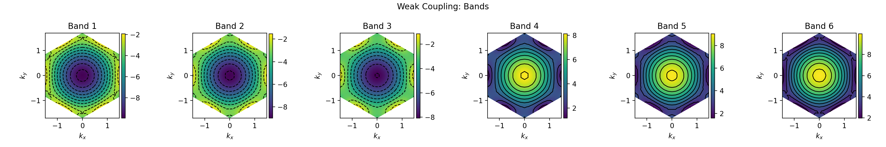
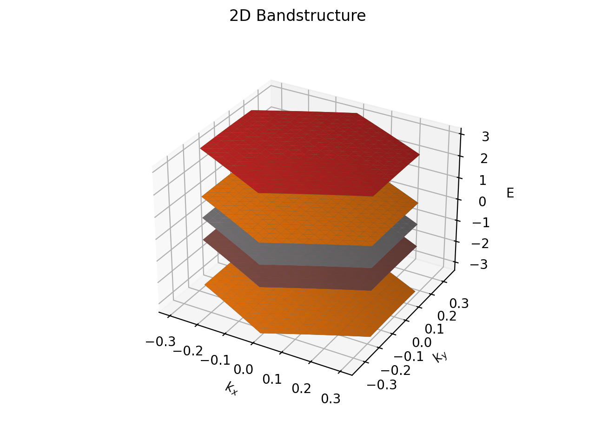

# Article Figures

## Article 1010.1819

### Check k-points


### Check noninteracting bandstructure


### Check weak coupling limit


### Check strong coupling limit


**Gap info:**

```
Gap is 12.75
U/T is 4.25
mean_U is 5.62
```

## Article 1208.0116

### Check k-points


### Check noninteracting bandstructure


### Check weak coupling limit



### Check strong coupling limit


**Gap info:**

```
Gap is -6.53
U/T is 5.85
mean_U is 5.07
```

## Article 1812.04213

### Check k-points


### Check noninteracting bandstructure


### Check weak coupling limit


### Check strong coupling limit


**Gap info:**

```
Gap is -24.16
U/T is 0.10
mean_U is 0.10
```

## Article 2012.04554

### Check k-points


### Check noninteracting bandstructure


### Check weak coupling limit


### Check strong coupling limit


**Gap info:**

```
Gap is -8.73
U/T is 2.48
mean_U is 2.52
```

## Article 2108.02159

### Check k-points


### Check noninteracting bandstructure




### Check weak coupling limit


### Check strong coupling limit


**Gap info:**

```
Gap is 20.57
U/T is 3.57
mean_U is 8.75
```

## Article 2111.01152

### Check k-points


### Check noninteracting bandstructure


### Check weak coupling limit


### Check strong coupling limit


**Gap info:**

```
Gap is 159.61
U/T is 0.00
mean_U is 0.00
```

## Article 2112.07523

### Check k-points


### Check noninteracting bandstructure


### Check weak coupling limit


### Check strong coupling limit


**Gap info:**

```
Gap is -9.85
U/T is 0.20
mean_U is 0.04
```

## Article 2308.07488

### Check k-points


### Check noninteracting bandstructure


### Check weak coupling limit


### Check strong coupling limit


**Gap info:**

```
Gap is -26578.18
U/T is 3253.24
mean_U is 26723.03
```

