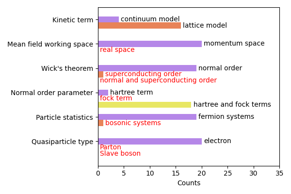

# 2023/06/19
- [x] Identify boundaries of utilizing LLM by few-shot prompting to solve HF problems. Document the successful cases as well as failed cases, especially the failed ones will form the key messages of the ppaer.
  - Mathematical derivation
- [ ] Demonstrate LLM's Capability of Knowledge : Assess the extent to which LLM can understand physics without relying on explicit examples.
- [ ] Demonstrate LLM's Capability of Generality: Evaluate the degree to which LLM can be teached with examples.
- [x] Tag the collection of papers in Zotero, and find missing genres after that. Categorize by multiple dimensions (**bold** indicates "Contained"):
  - Kinetic term (**continuum model** | **lattice model**)
  - Mean field working space (**momentum space** | real space)
  - Wick's theorem (**normal order** | superconducting order | normal and superconducting order)
    - Normal order parameter  (**hartree term** | fock term | **hartree and fock terms**)
  - Particle statistics (**fermion systems** | bosonic systems )
  - Quasiparticle type (**electron** | Parton | Slave boson)
  - 
- [x] Resolving the issue of long-term memory by saving intermediate results on file.
- [x] Bard benchmark and comparison
